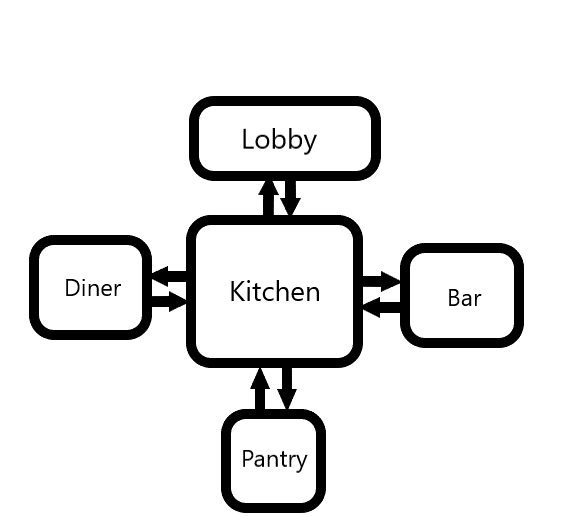

# The Overlook

*Experience The Shining from Jack's point of view. You wake up locked in the pantry, with a strange urge to make everyone stay!*

**My first game!** Text-based, horrifying, made with Scala and including ASCII art. Final project for the Aalto University Programming 1 course in 2019.

## Compiling

I touched this project for the last time in 2019 and haven't attempted to compile it since then. Worked to run the GUI in Eclipse 2017.

## Walkthrough

*Note: You have to use the console to answer Loyd when you buy a drink.*

The Pantry room:
1. Pick up the fireaxe and use it on the door. Go north.

The Kitchen:
1. Enter the diner to the west, get the money.
2. Go east twice to enter the bar.
3. Use the money or talk to Loyd and buy a drink.
4. Speak with him again and he will drop his keycard. Get the keycard.
5. Now go west to the kitchen and use the keycard. The lobby door to the north will open.
6. Go north without the knife so Wendy won't be startled.

The Lobby:
1. Talk to Wendy, go south to the kitchen. Use the knife. Game completed!

## Map

